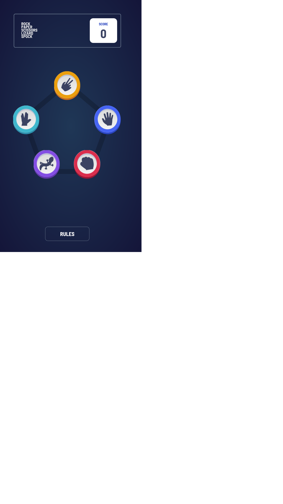

## Table of contents

- [Overview](#overview)
  - [The challenge](#the-challenge)
  - [Screenshot](#screenshot)
  - [Links](#links)
  - [Built with](#built-with)
  - [Continued development](#continued-development)
- [Author](#author)
- [Acknowledgments](#acknowledgments)

## Overview

### The challenge

Users should be able to:

- View the optimal layout for the game depending on their device's screen size
- Play Rock, Paper, Scissors against the computer

### Screenshot

### Links

- Live Site URL: [Add live site URL here](https://rpss-game.netlify.app/)

### Built with

- CSS custom properties
- Flexbox
- Absolute positioning
- Mobile-first workflow
- [React](https://reactjs.org/) - JS library

### Continued development

Adding tests and fixing some minor bugs with positioning.

## Author

- Website - [Nitsan Cohen portfolio](https://nitsan-portfolio.netlify.app/)

## Acknowledgments

I thank my wife that's lets me sit on the computer hours after hours :)
